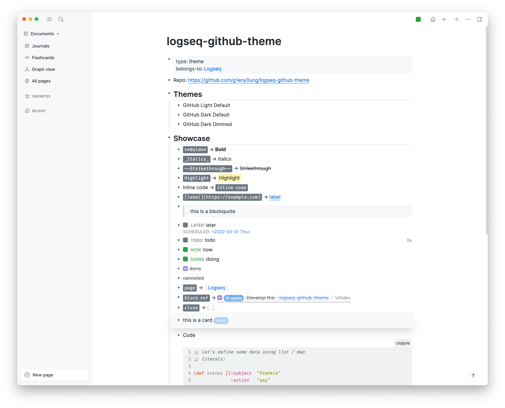
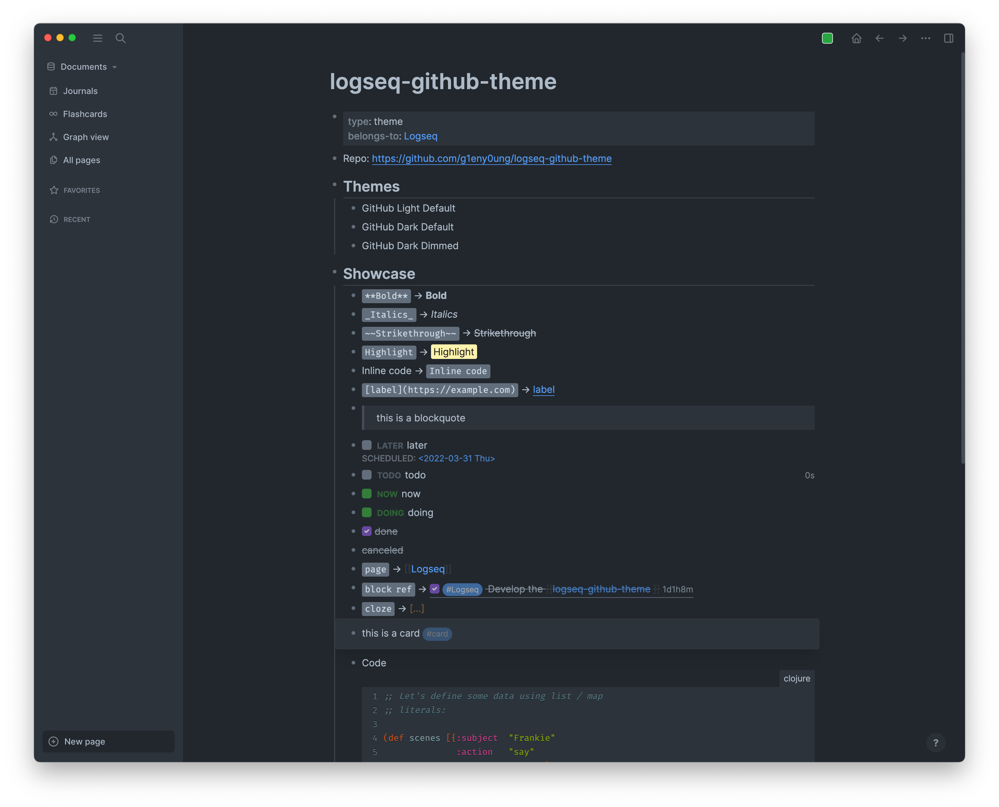

# [logseq](https://logseq.com/)-github-theme

😻 GitHub themes for Logseq.

## Screenshots

| Light                                 | Dark                                | Dark Dimmed                                       |
| ------------------------------------- | ----------------------------------- | ------------------------------------------------- |
|  |  |  |

## License

MIT @ [g1eny0ung](https://github.com/g1eny0ung)

Thanks to [github-vscode-theme](https://github.com/primer/github-vscode-theme) for the inspiration and logo.
